# UE5 多人联机射击游戏 Demo - 箐英班大作业

## 简介

这是一个基于 **Unreal Engine 5** 和 **C++** 开发的多人联机第一人称射击游戏 Demo。
项目包含了完整的网络同步框架，实现了从主菜单建立主机、客户端通过 IP 加入、主菜单等待到跳转至主关卡的完整流程。

## 完成度概览

| 核心功能 | 进度 | 备注 |
| :--- | :---: | :---: |
| **会移动和攻击玩家的敌人功能** | 完成 | 在demo自带蓝图基础上实现，击败敌人得分 |
| **基础的得分和游戏胜利机制** | 完成 | 添加了其他机制，如打靶、击杀玩家与敌人等 |
| **实现多人网络对战** | 完成 | 实现了各物件的网络复制与同步，并实现了双人对战 |
| **渲染、游戏AI** | 暂未完成 |  |

除了基本要求的功能外，还额外实现了一些功能，可以在下面内容查看。

## 主要功能

* **多人联机系统**：
    * 基于 Listen Server（侦听服务器）架构。
    * 支持 **Host (建立主机)** 与 **Join (加入游戏)** 功能。
    * 支持输入 IP 地址进行局域网或公网直连。
* **关卡切换流程**：
    * 实现了主菜单 -> 战斗关卡的无缝切换。
    * 使用 `ServerTravel` 确保所有已连接客户端同步跳转。
    * 利用demo自带的资产重新调整了关卡布局。
* **战斗系统**：
    * 完整的生命值、弹药射击、场景物品的网络复制与同步。
    * 射击打靶（方块）计分机制（定时分波次的方块随机生成于场景中，并分配不同分值与赋予不同颜色）。
    * 击杀计分系统（窃取被击杀玩家一半分数）与死亡重生机制。
    * 游戏预开始倒计时机制（倒计时时玩家与NPC敌人无法射击与移动）。
    * 游戏结算机制以及结束重开机制。
    * 倒计时角色狂暴机制（玩家移动速度加快）。
    * 移动的敌人与攻击玩家，击杀敌人得大量分。
    * 场景中央定时生成回血包，并有简易动态特效。
* **UI 交互**：
    * 动态网络状态检测（根据是房主还是客户端显示不同按钮）。
    * 实时血条与弹药显示。
    * 实时游戏剩余时间显示。
    * 简易的计分板功能（按Tab键呼出）。
    * 狂暴状态简易的边框动态动画。
    * 开始游戏与结束游戏中央简易的动画文字特效。

## 游戏截图

### 主菜单
这里是建立主机和输入 IP 加入的地方。主菜单显示了游戏的详细规则。
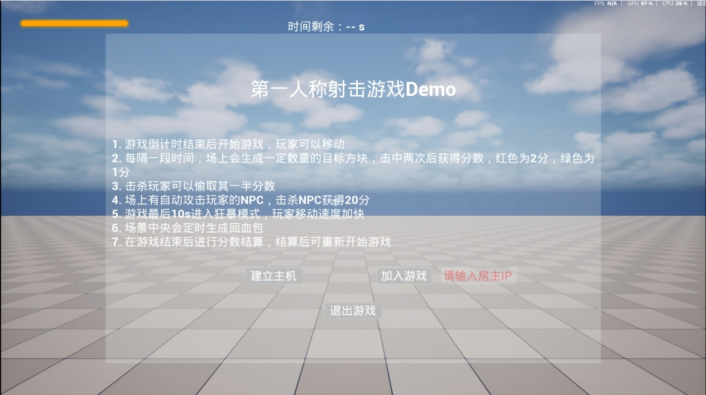

在点击建立主机后，在房主端建立主机并等待其他玩家的加入。
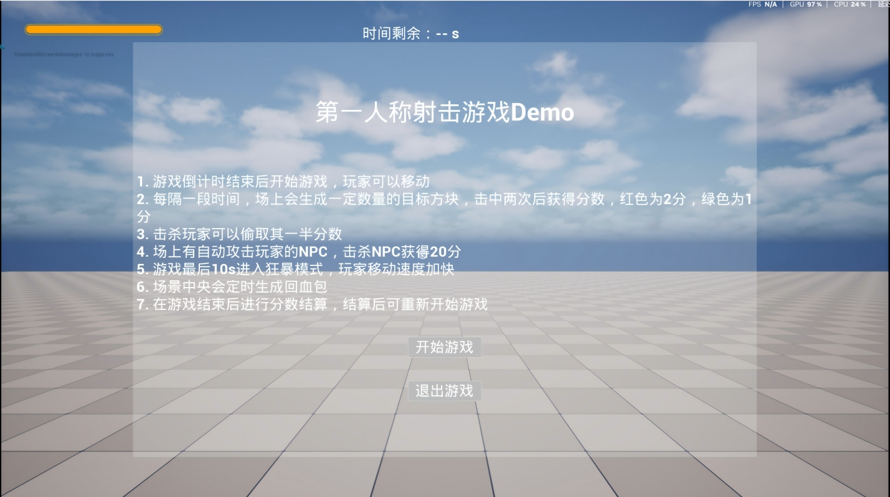

其他玩家可以通过Ip地址进行加入，演示视频里在同一电脑上进行演示，所以使用回环地址。在成功加入房间后，等待房主开始游戏。
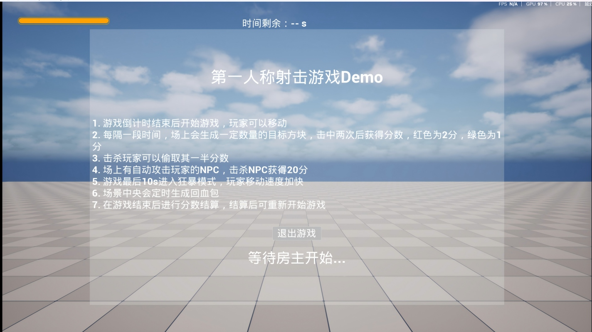

### 战斗关卡
#### 战斗主关卡
这是战斗主关卡的俯视图，基于UE5官方demo自带的一些蓝图布置而成。
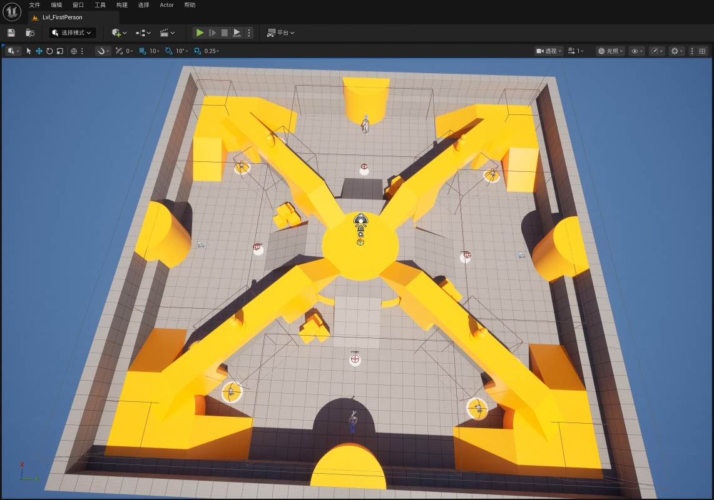

#### 游戏开始
房主开始游戏后，所有玩家跳转到战斗关卡。这里是游戏开始时玩家出生点画面。
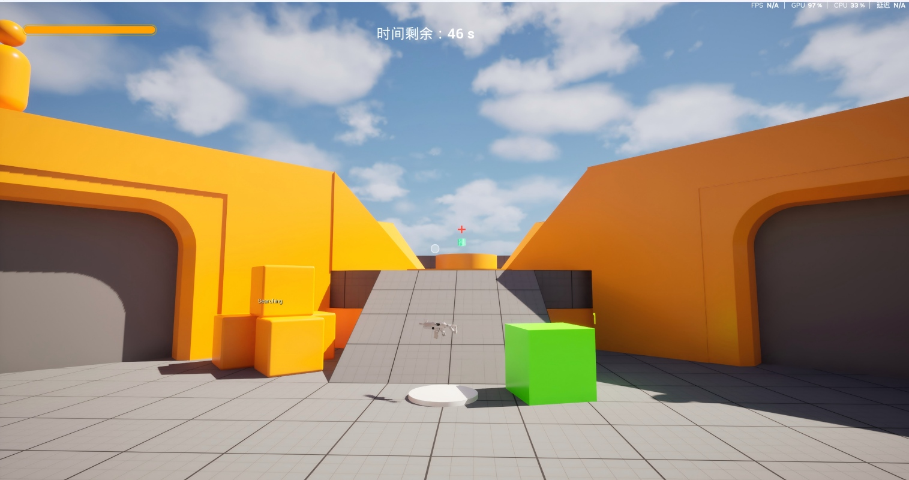

游戏开始倒计时。在倒计时时中央显示动态文字，在开始游戏前玩家和敌人无法移动和射击，开始后解锁。
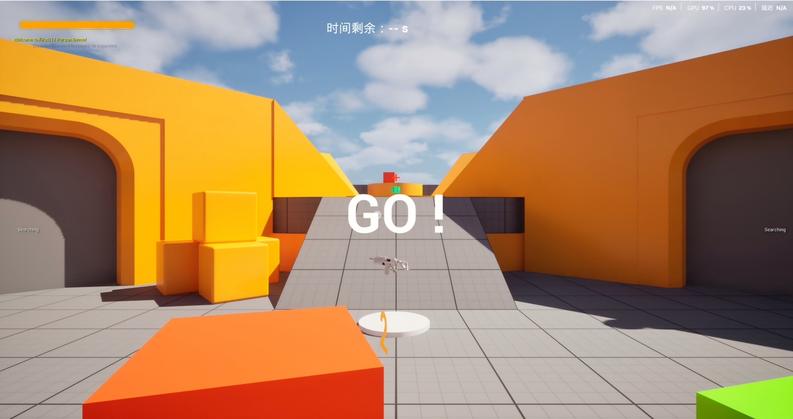

#### 随机生成目标方块
场景中随机生成一些目标方块，并赋予不同分值：红色为2分，绿色为1分，在初次击中后会变大，再次射击后得分。每隔一段时间后，
方块会在场景中再次生成。
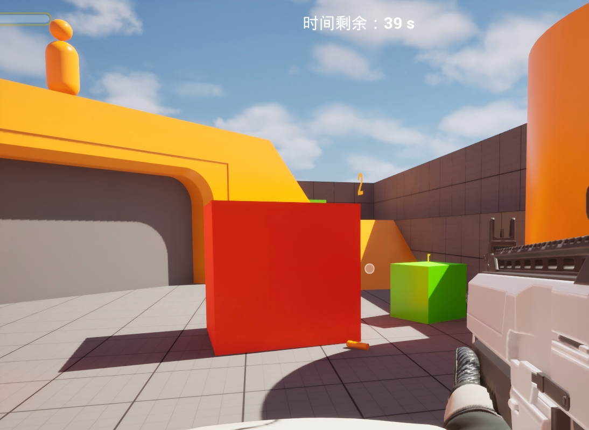

#### 敌人移动与攻击
利用UE5官方demo自带的NPC蓝图，实现了移动与攻击玩家的敌人。敌人攻击玩家后，能看到血量减少，并且边框有受击特效。血量
在客户端与主机端之间也实现了同步。击杀敌人可以获得20分。
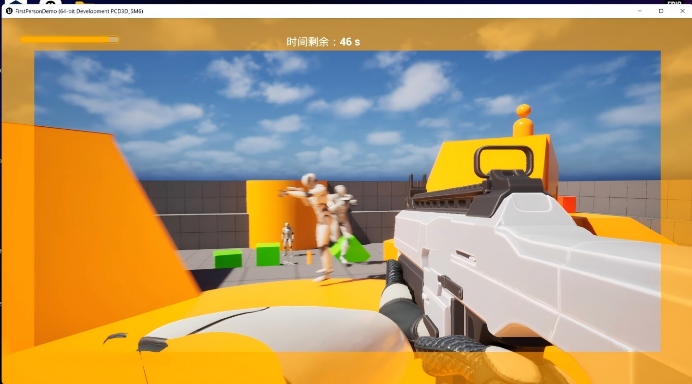

#### 多人玩家对战
demo实现了双人射击对战，并实现了生命值、射击、计时、场景物品、死亡动画等的网络复制与同步。
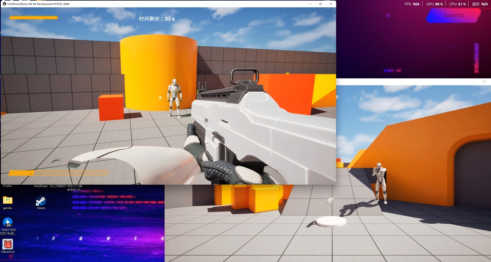
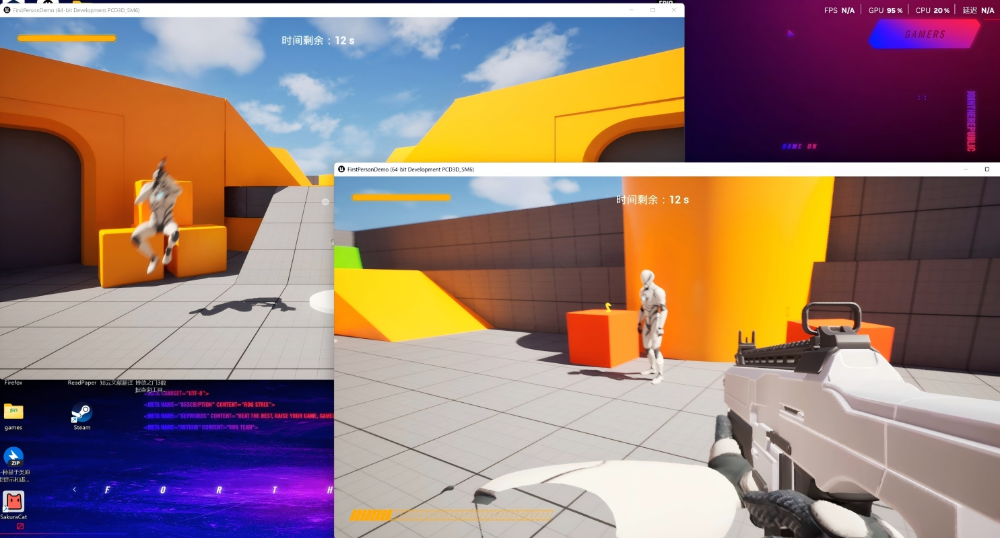

击杀玩家可以窃取被击杀玩家的一半分数。死亡后能够重生。可以通过tab呼出计分板查看自己的分数与其他玩家的分数。这里的计分板经过排序和
高亮显示自己的分数的处理。
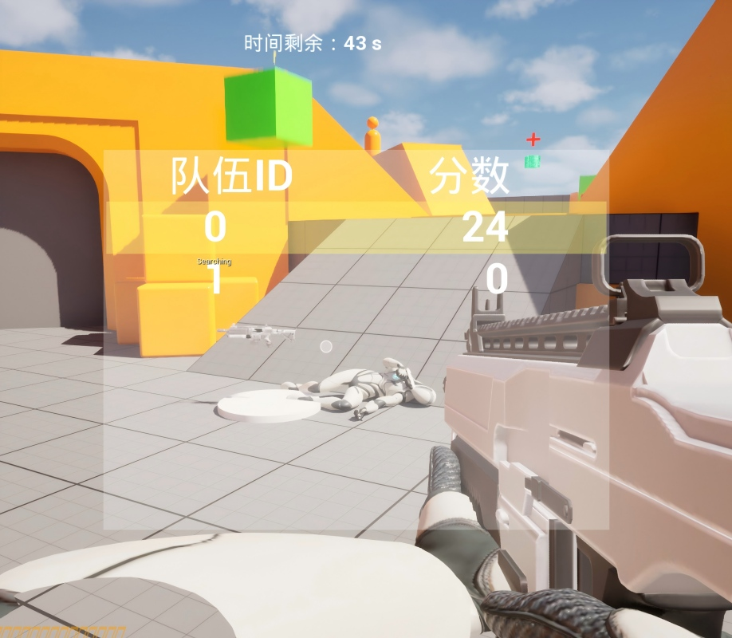

#### 简易回血装置
实现了一个简易回血装置，置于场景中央。每隔一段时间会重新生成。红十字始终会跟随玩家视角。
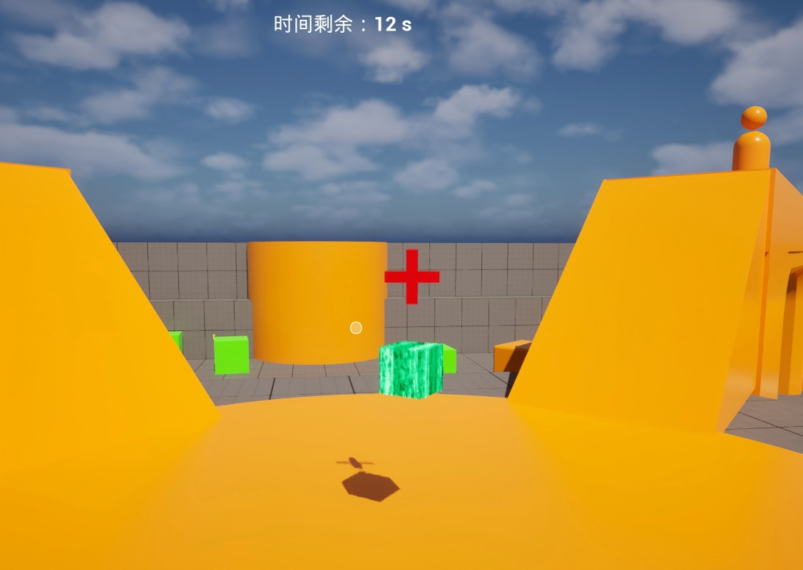

#### 狂暴状态
在游戏最后10s，中央会提示进入狂暴状态。此时玩家的移动速度加快，并且游戏边框有红色动态特效提示。
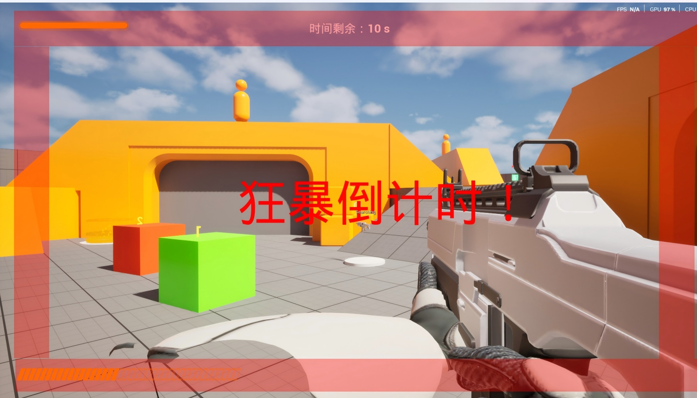

#### 游戏结束
在游戏倒计时结束后，会进行胜负关系结算，取决于两个玩家的分数。结束后玩家、敌人再次无法移动和射击。任一玩家可以通过点击重新开始
按钮重新开始一轮游戏。也可以通过点击退出游戏结束游戏。
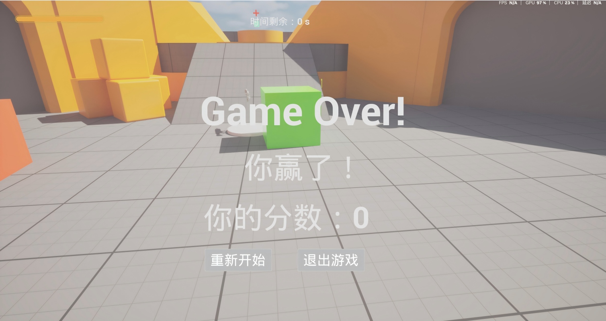

## 演示视频链接
通过网盘分享的文件：箐英班大作业演示.mp4
链接: https://pan.baidu.com/s/1QP_ewMxousoBSR_W6uQ1gA?pwd=v3w4 提取码: v3w4 
--来自百度网盘超级会员v2的分享

---
*Created by [tanjie]*
